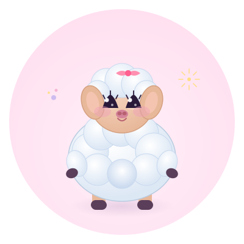
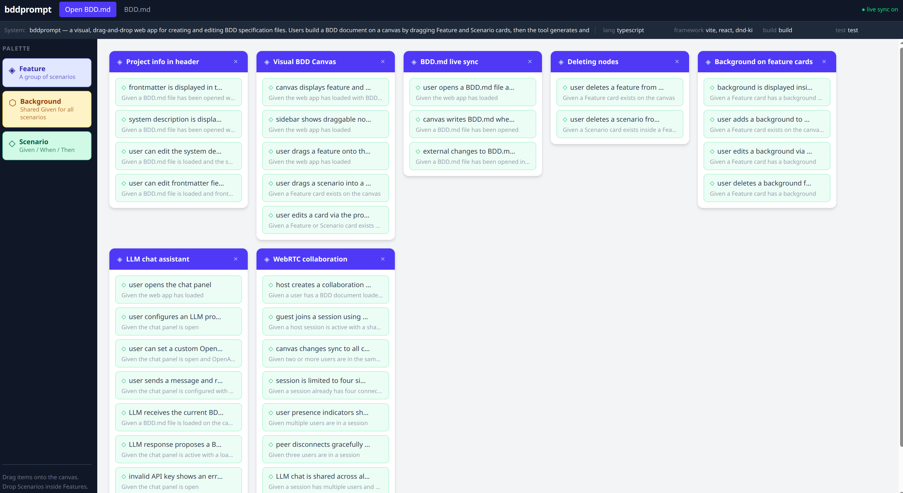

<div align="center">



# 🌟 bddprompt

**A delightful visual editor for BDD specifications**

*Drag, drop, and collaborate on your BDD specs with ease*



</div>

---

## ✨ What is bddprompt?

**bddprompt** is a visual, drag-and-drop web application that makes writing [BDD](https://en.wikipedia.org/wiki/Behavior-driven_development) (Behavior-Driven Development) specifications actually enjoyable! Instead of wrestling with markdown files, you build your specs on an interactive canvas:

- 🎯 **Drag & Drop** — Build your BDD document by dragging Feature, Scenario, and Background cards onto the canvas
- 📝 **Live Sync** — Your changes automatically sync to a `BDD.md` file (and vice versa!)
- 🤖 **AI Assistant** — Chat with an LLM to help refine your specs (Claude or OpenAI-compatible)
- 🔗 **Real-time Collaboration** — Work together with your team using WebRTC (up to 4 peers)

The generated `BDD.md` file follows the [BAADD](https://github.com/dweng0/BAADD) format — a specification-driven framework where AI agents can read your BDD specs and help bring them to life.

---

## 🚀 Quick Start

### Try it Online

🌐 **Live Demo**: [https://dweng0.github.io/BDDPrompt](https://dweng0.github.io/BDDPrompt)

*(If you forked this repo, update the URL to `https://yourusername.github.io/your-repo-name`)*

---

### Run Locally

#### Requirements
- Node.js 18+

#### Install & Run

```bash
# Install dependencies
npm install

# Start the web app in development mode
npm run web
```

Then open your browser to the displayed URL (usually `http://localhost:5173`).

#### Build for Production

```bash
# Build the web app to the docs/ folder (for GitHub Pages)
npm run web:build
```

The built app will be in the `docs/` folder, ready for GitHub Pages deployment.

---

## 🎨 How to Use

1. **Open a BDD.md file** — Click "Open BDD.md" in the header to load an existing spec
2. **Drag from the palette** — Pull Feature, Background, or Scenario cards onto the canvas
3. **Nest scenarios** — Drop Scenario cards inside Feature cards to organize them
4. **Edit in the sidebar** — Click any card to edit its properties in the right panel
5. **Chat with AI** — Open the chat panel to get help refining your specifications
6. **Collaborate** — Click Share to start a collaboration session with your team

Your changes are automatically saved to the BDD.md file!

---

## 📁 Example Output

Here's what a generated `BDD.md` file looks like:

```markdown
---
language: typescript
framework: vite, react, dnd-kit
build_cmd: npm run build
test_cmd: npm test
birth_date: 2026-03-06
---

System: My awesome project

    Feature: User authentication

        Scenario: Successful login
            Given I am on the login page
            When I enter valid credentials
            Then I am redirected to the dashboard
```

---

## 🧪 Development

```bash
npm run dev        # Run with Vite dev server
npm run web        # Run web app with Vite dev server
npm run web:build  # Build web app to docs/ folder
npm test           # Run tests with Vitest
npm run lint       # Run ESLint
npm run format     # Run Prettier
```

## 📦 GitHub Pages Deployment

This project is configured to automatically deploy to GitHub Pages:

1. Go to your repository **Settings** → **Pages**
2. Under **Build and deployment**, select **GitHub Actions** as the source
3. Push to the `main` branch — the app will automatically build and deploy

The workflow:
- Builds the web app to the `docs/` folder
- Deploys to GitHub Pages on every push to `main`

To deploy manually:
```bash
npm run web:build
git add docs/
git commit -m "Update GitHub Pages"
git push
```

---

## 🐑 About BAADD

This project is part of the [BAADD](https://github.com/dweng0/BAADD) ecosystem — a framework where an AI agent builds and maintains projects driven entirely by a `BDD.md` spec file. Write the behavior, watch it come to life!

---

<div align="center">

Made with 💜 and a very cute sheep

</div>
